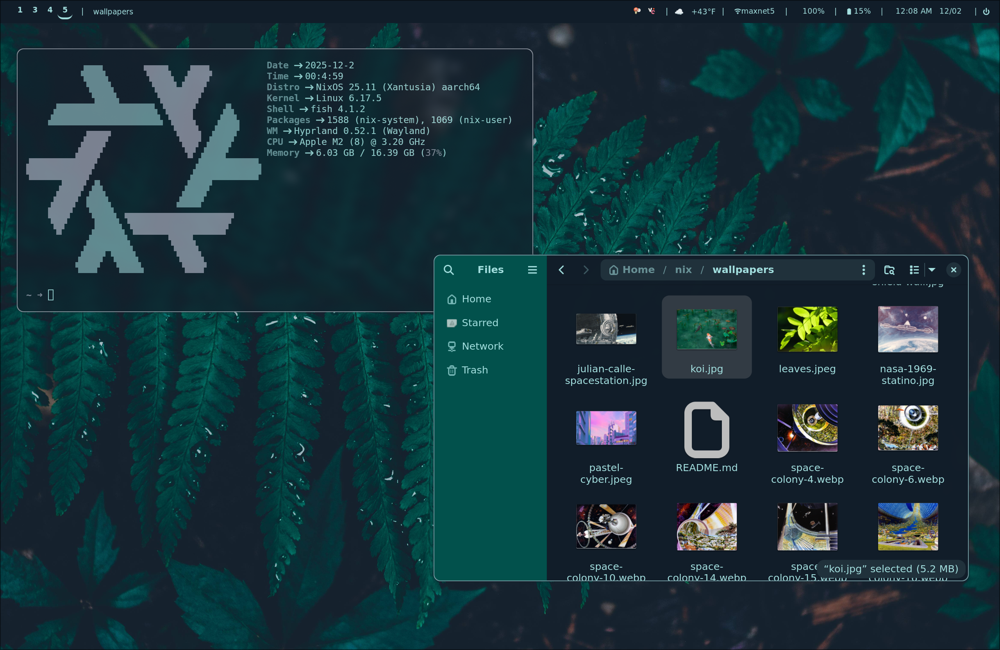

# NixOS configuration
multi-system configuration with Hyprland, Stylix, and Apple Silicon support

i tend to bounce around between a few machines, so i needed a single flake that i could distribute to keep consistent.

## screenshots



## features

### desktop environment
- hyprland - wayland compositor with lots of configuration
- waybar - status bar with spotify, weather, and custom power menu
- stylix - automatic theme based on wallpaper, with included wallpaper switch script
- notifications - themed notifications with mako

### dev tools
- neovim
- kicad and kikit plugin
- robust sdr tool suite
- godot engine

### mutli-machine info
- mac-asahi (aarch64) - my daily driver
- asus-zephyrus (x86_64) - x86 machine with dedicated nvidia gpu
- cardboard (x86_64) - itx machine built into a cardboard box

### homelabby stuff
- tailscale VPN
- local nix cache (in progress)
- docker & docker compose
- ssh access (mostly used in conjunction with tailscale)

Wallpaper switching command: 

```wallpaper-switch my-wallpaper.jpg```
1. updates current to my-wallpaper.jpg
2. regenerated stylix color pallete
3. applies changes & rebuilds nix system

### Wallpaper Switching Demo
  <table>
    <tr>
      <td></td>
      <td></td>
    </tr>
    <tr>
      <td align="center">theme 1</td>
      <td align="center">theme 2</td>
    </tr>
  </table>

structure
```
  ├── flake.nix              # flake entry point
  ├── hosts/                 # per-machine configurations
  │   ├── mac-asahi/         # apple silicon mac
  │   ├── asus-zephyrus/     # x86 laptop
  │   └── cardboard/         # x86 itx machine
  ├── homeManagerModules/    # shared user configurations
  │   ├── hypr/              # hyprland configuration and extensions
  │   ├── programs/          # application configs
  │   └── shell/             # terminal setup
  ├── nixosModules/          # system-level modules
  └── wallpapers/            # theme wallpapers
```

## todo
- simplify wallpaper switch system (maybe waybar widget)
- low battery notification
- fix nightlight (doesnt work out of the box)
