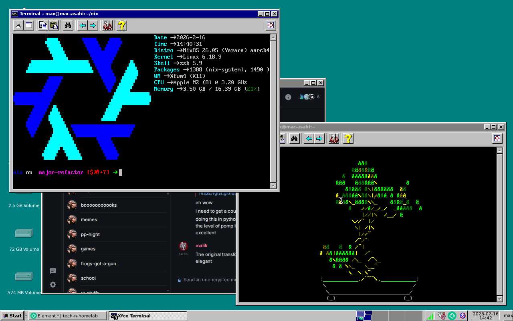

# NixOS configuration
multi-system, multi-wm nixos config with apple silicon support

i tend to bounce around between a few machines, so i needed a single flake that i could distribute to keep consistent.

## screenshots




## desktop environments
### hyprland - wayland compositor with lots of configuration
- waybar - status bar with spotify, weather, and custom power menu
- stylix - automatic theme based on wallpaper, with included wallpaper switch script
- notifications - themed notifications with mako
- shared modules - centralized fonts and stylix configuration across all systems

### XFCE (chicago95) - a retro xfce theme
- start menu
- full icon theme
- retro fonts
- terminal theme

### dev tools
- neovim (full ide config with lots of plugins)
- kicad and kikit plugin
- full rust dev toolchain
- robust sdr tool suite
- docker, docker-compose, kubectl
- godot engine
- virtual machine tooling

### multi-machine info
- mac-asahi (aarch64) - my daily driver, apple silicon with asahi linux
- mac-asahi-xfce (aarch64) - same mac, but chicago95 xfce theme
- asus-zephyrus (x86_64) - laptop with nvidia gpu, asus-specific hardware support
- cardboard (x86_64) - itx machine built into a cardboard box, local nix cache server
- tower (x86_64) - gaming desktop with nvidia gpu, bluetooth audio, steam/gamemode support

### homelabby stuff
- tailscale VPN
- local nix cache (in progress)
- docker with system-level integration
- ssh access (mostly used in conjunction with tailscale)

### gaming (tower)
- steam with gamemode integration
- nvidia gpu with proprietary drivers
- lutris and bottles
- mangohud performance overlay
- gamescope compositor
- bluetooth audio for wireless headsets
- dedicated games drive auto-mounted at /mnt/games

Wallpaper switching command: 

```bash
wallpaper-switch my-wallpaper.jpg
```
1. updates current to my-wallpaper.jpg
2. regenerated stylix color pallete
3. applies changes & rebuilds nix system

### Wallpaper Switching Demo
  <table>
    <tr>
      <td></td>
      <td></td>
    </tr>
    <tr>
      <td align="center">fern</td>
      <td align="center">sakura</td>
    </tr>
  </table>

structure
```
  ├── flake.nix              # flake entry point
  ├── hosts/                 # per-machine configurations
  │   ├── mac-asahi/         # apple silicon mac (hyprland)
  │   ├── mac-asahi-xfce/    # apple silicon mac (xfce/chicago95)
  │   ├── asus-zephyrus/     # x86 laptop
  │   ├── cardboard/         # x86 itx machine
  │   └── tower/             # gaming desktop
  ├── homeManagerModules/    # shared user configurations
  │   ├── hypr/              # hyprland configuration and extensions
  │   ├── xfce/              # xfce + chicago95 config
  │   ├── programs/          # application configs
  │   ├── gaming.nix         # steam, lutris, mangohud config
  │   └── shell/             # terminal setup
  ├── nixosModules/          # system-level modules
  │   ├── fonts.nix          # shared fonts
  │   ├── stylix.nix         # shared theme base
  │   ├── audio.nix          # pipewire + bluetooth
  │   ├── nix-settings.nix   # cachix, experimental/unfree nix settings
  │   └── automount.nix      # usb automounting
  └── wallpapers/            # theme wallpapers
```

## todo
- simplify wallpaper switch system (maybe waybar widget)
- low battery notification
- fix lid switch/laptop behavior
- expand options for desktop environments
    - probably look at offering xfce on more machines
    - niri config?

